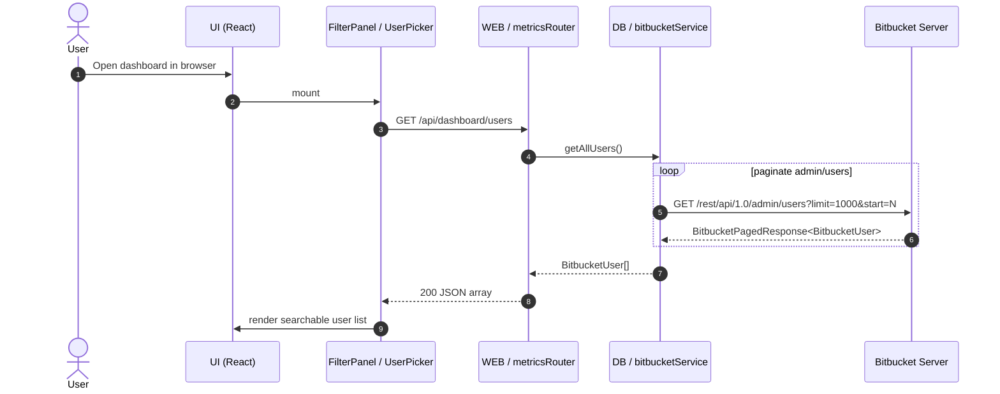
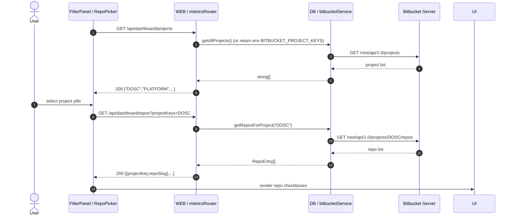
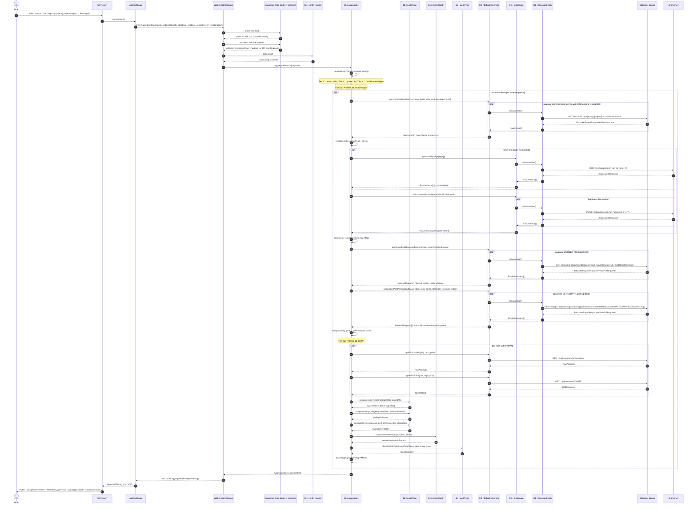
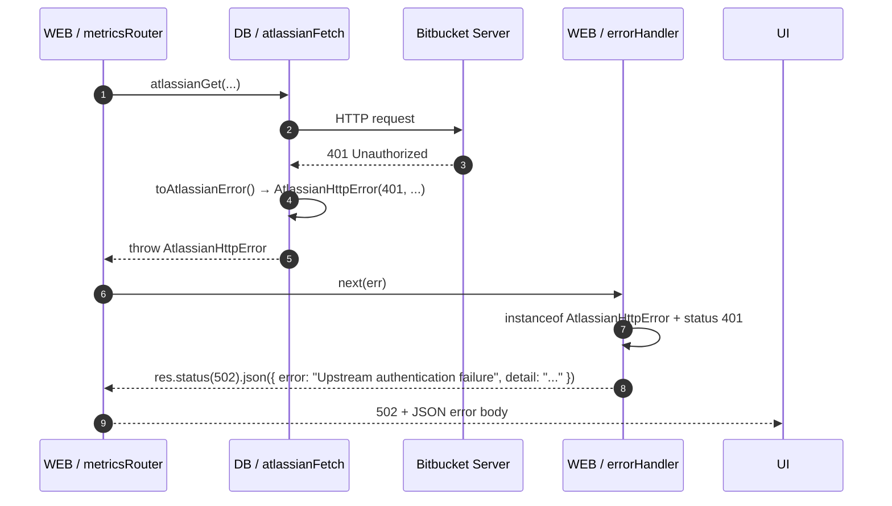
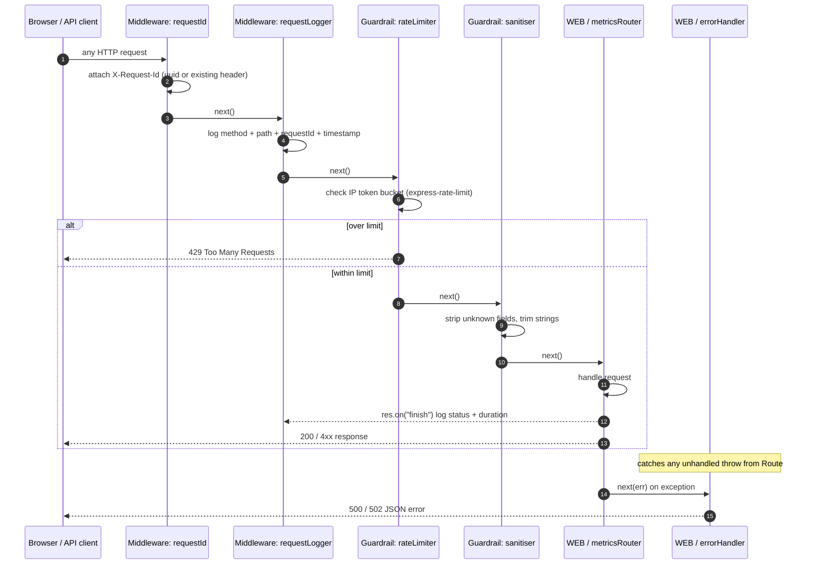
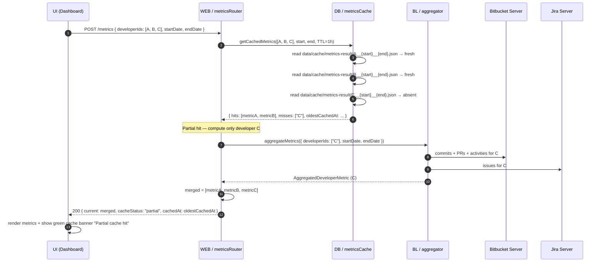

# Sequence Diagrams — AI Productivity Tool

---

## 1. Dashboard Load (`GET /api/dashboard/users`)



---

## 2. Project & Repo Picker Load



---

## 3. Metrics Request (`POST /api/dashboard/metrics`)



---

## 4. Error Flow



---

## 5. Request lifecycle (middleware stack)



---

## 6. Sync Job Trigger Flow (`POST /api/dashboard/sync/trigger`)

```mermaid
sequenceDiagram
    autonumber
    actor Admin
    participant UI as UI (SyncPage)
    participant Hook as useSync
    participant SR as WEB / syncRouter
    participant Job as jobs / metricsSync
    participant Cache as DB / metricsCache
    participant BL as BL / aggregator
    participant BB as Bitbucket Server
    participant JIRA as Jira Server

    Admin->>UI: Select users + schedule → Save & Run
    UI->>Hook: saveAndRun()

    opt purgeLogsOnRun
        Hook->>SR: DELETE /api/dashboard/sync/logs
        SR->>Job: purgeRunLogs()
        SR-->>Hook: 204 No Content
    end

    opt schedule = daily or weekly
        Hook->>SR: POST /api/dashboard/sync/config {developerIds, intervalMinutes}
        SR->>Job: rescheduleInterval(intervalMinutes, developerIds)
        SR-->>Hook: 200 SyncConfig
    end

    Hook->>SR: POST /api/dashboard/sync/trigger {developerIds}
    SR->>SR: validate developerIds
    SR->>Job: triggerSyncForUsers(developerIds) — non-blocking
    SR-->>Hook: 202 { queued: true }

    Hook->>SR: GET /api/dashboard/sync/status
    SR->>Job: getSyncStatus()
    SR-->>Hook: { running: true, ... }
    Hook->>UI: update status badge → Running

    note over Job: Runs asynchronously in the background

    Job->>Job: runSync(developerIds)
    Job->>Job: read data/sync-config.json (override check)

    loop for each batch of 10 users
        Job->>BL: aggregateMetrics({ developerIds: batch, ... })
        BL->>BB: commits + PRs + activities
        BL->>JIRA: issues by assignee + key
        BL-->>Job: AggregatedDeveloperMetric[]
        Job->>Cache: setCachedMetrics(batch, metrics)
        Cache->>Cache: write data/cache/metrics-result/{devId}__{start}__{end}.json
    end

    Job->>Job: write data/sync-logs/{timestamp}.json
    Job->>Job: running = false; lastRunAt = now

    Hook->>SR: GET /api/dashboard/sync/status (5s poll)
    SR-->>Hook: { running: false, lastRunAt: ... }
    Hook->>UI: update status badge → Idle

    Hook->>SR: GET /api/dashboard/sync/logs
    SR-->>Hook: SyncRunLog[]
    Hook->>UI: render run history table
```

---

## 7. Partial Cache Hit Flow (`POST /api/dashboard/metrics`)


