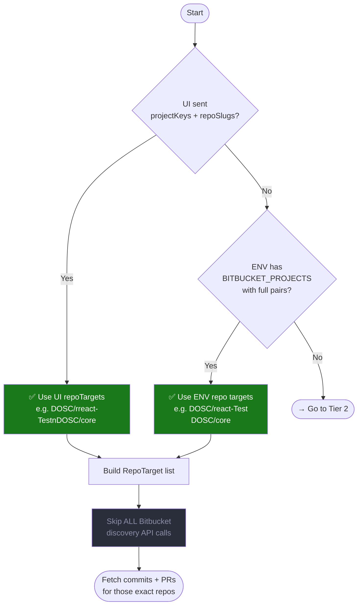

# Repo Resolution Flowcharts

These diagrams show how the backend decides which Bitbucket repos to scan for each request.

The three tiers in order of priority:

- **Tier 1 — Exact:** `PROJECT/repo` pairs are known upfront → no discovery
- **Tier 2 — Project-scoped:** project keys known, repos discovered per-user by activity
- **Tier 3 — Auto-discover:** nothing provided → repos discovered from each user's profile

UI values always override env values.

---

## Tier 1 — Full `[ProjectKey, Repo]` Pairs Provided

Triggered when the UI sends `repoTargets` (explicit `{projectKey, repoSlug}` pairs), or `BITBUCKET_PROJECTSreact-Test(e.g. `DOSC/react-foundation,DOSC/core`).



**Result:** Exactly the listed `PROJECT/repo` pairs — fastest path, no extra API calls.

---

## Tier 2 — Only Project Keys Provided

Triggered when the UI sends `projectKeys` without `repoSlugs`, or `BITBUCKET_PROJECT_KEYS` is set in env with `BITBUCKET_PROJECTS` empty.

**Key principle:** Use the developer's Bitbucket profile (`/profile/recent/repos`) to find repos they actually worked in — never fall back to scanning the full project repo list. Scanning all repos causes thousands of wasted API calls for repos with zero activity.

```mermaid
flowchart TD
    A([Start]) --> B{Full repo pairs\nprovided?}
    B -- No --> C{UI sent\nprojectKeys?}

    C -- Yes --> D[Use UI project keys\ne.g. DOSC, PLATFORM]
    C -- No  --> E{ENV has\nBITBUCKET_PROJECT_KEYS?}
    E -- Yes --> F[Use ENV project keys]
    E -- No  --> NEXT([→ Go to Tier 3])

    D --> H[GET /projects/{key}/repos\nfor each project key — once, shared]
    F --> H

    H --> I[Full candidate set\ne.g. 452 repos across 4 projects]

    I --> J[GET /profile/recent/repos\nper developer — 1 call each, in parallel]

    J --> K[Intersect profile repos\nwith candidate set]

    K --> L{Profile intersection\nnon-empty?}
    L -- Yes --> M[✅ Use profile repos only\ne.g. 5 repos per dev]
    L -- No  --> N[⚠️ Return empty list\nNo repos to scan — dev has\nno profile history in these projects]

    M --> O([Fetch commits + PRs\nfor profile repos only])
    N --> P([Return zero metrics\nfor this developer])

    style D fill:#1a5a8a,color:#fff
    style F fill:#1a5a8a,color:#fff
    style M fill:#1a7a1a,color:#fff
    style N fill:#7a4a00,color:#fff
```

**Result:** Only the repos the developer recently touched — typically 3–10 repos vs. scanning all 452. Total API calls drop from ~25,000 to ~100 for 7 developers.

> **Why no fallback to full list?** Falling back to all 452 repos when profile returns empty causes ~1,800 live API calls per developer per request (452 repos × 4 months), making the dashboard unusably slow. If a developer has no profile history in the configured projects, return empty metrics rather than spend minutes probing every repo.

---

## Tier 3 — Auto-Discover from User Profile

Triggered when neither project keys nor repo pairs are provided anywhere — UI or env.

```mermaid
flowchart TD
    A([Start]) --> B{Full repo pairs\nprovided?}
    B -- No --> C{Project keys\nprovided?}
    C -- No --> D[✅ Tier 3: Auto-discover\nfrom user profile]

    D --> E[For each selected developer]

    E --> F[GET /rest/api/1.0/profile/recent/repos\n?username={devId}&limit=50]

    F --> G{API returned repos?}

    G -- Yes --> H[Use profile repos\ne.g. DOSC/react-Test\nPLATFORM/infra-core\n...]

    G -- No  --> I[Fallback: scan ALL\nvisible projects\nGET /rest/api/1.0/projects]
    I --> J[List all repos\nunder all projects]
    J --> K[Probe each repo\nfor developer activity]
    K --> H

    H --> L[Deduplicate repos\nacross all selected users]
    L --> M([Fetch commits + PRs\nfor discovered repos])

    style D fill:#7a5a00,color:#fff
    style H fill:#1a7a1a,color:#fff
    style I fill:#5a2a00,color:#fff
```

**Result:** Repos each selected developer has recently contributed to — no manual config needed.

---

## Complete Decision Tree (All Tiers Combined)

```mermaid
flowchart TD
    START([User clicks Run Report]) --> A

    A{UI sent\nrepoTargets?}

    A -- YES --> T1U[🟢 TIER 1 via UI\nUse exact repo pairs\nfrom request]

    A -- NO --> B{ENV has\nBITBUCKET_PROJECTS\nwith full pairs?}

    B -- YES --> T1E[🟢 TIER 1 via ENV\nUse env repo pairs\nas exact targets]

    B -- NO --> C{UI sent\nprojectKeys only?}

    C -- YES --> T2U[🟡 TIER 2 via UI\nList all repos under\nUI project keys]

    C -- NO --> D{ENV has\nBITBUCKET_PROJECT_KEYS?}

    D -- YES --> T2E[🟡 TIER 2 via ENV\nList all repos under\nenv project keys]

    D -- NO --> T3[🔵 TIER 3\nAuto-discover from\nuser profile API]

    T1U --> EXEC
    T1E --> EXEC
    T2U --> PROFILE2[GET /profile/recent/repos\nper developer — intersect\nwith project repos]
    T2E --> PROFILE2
    PROFILE2 --> EXEC
    T3  --> PROFILE[GET /profile/recent/repos\nper selected developer]
    PROFILE --> EXEC

    EXEC([Fetch commits, PRs, diffs\nfor resolved repos per developer])
    EXEC --> AGG[Aggregate metrics\ncycleTime · reviewDepth\nworkType · linesChanged]
    AGG --> RESP([Return AggregatedDeveloperMetric[]])

    style T1U fill:#1a7a1a,color:#fff
    style T1E fill:#1a7a1a,color:#fff
    style T2U fill:#1a5a8a,color:#fff
    style T2E fill:#1a5a8a,color:#fff
    style T3  fill:#7a5a00,color:#fff
    style PROFILE2 fill:#1a5a8a,color:#fff
```

---

## Quick Reference Summary

| Tier                 | What is set                                                                     | Source    | API calls made                                                        | Est. calls (7 devs) |
| -------------------- | ------------------------------------------------------------------------------- | --------- | --------------------------------------------------------------------- | ------------------- |
| **1 — Full pairs**   | `repoTargets` in request, or `BITBUCKET_PROJECTS=DOSC/react-foundation`          | UI or ENV | None — direct                                                         | ~50                 |
| **2 — Project keys** | `projectKeys` in request, or `BITBUCKET_PROJECT_KEYS=DOSC,PLATFORM`             | UI or ENV | List repos once + `/profile/recent/repos` per dev (no full-list scan) | ~100                |
| **3 — Auto**         | Nothing                                                                         | Auto      | `/profile/recent/repos` per developer                                 | ~100                |

---

## ENV Variables Cheat Sheet

```bash
# Tier 1 — pin exact repos (no discovery)
BITBUCKET_PROJECTS=DOSC/react-Test,DOSC/core
BITBUCKET_PROJECT_KEYS=

# Tier 2 — project keys only (repos discovered per developer)
BITBUCKET_PROJECTS=
BITBUCKET_PROJECT_KEYS=DOSC,PLATFORM

# Tier 3 — auto-discover (leave both empty)
BITBUCKET_PROJECTS=
BITBUCKET_PROJECT_KEYS=
```

---

## UI State → POST Body Mapping

```
User selects project pills [DOSC] and repo checkboxes [react-Test, core]
  → { repoTargets: [{ projectKey:"DOSC", rreact-Testoundation" }, { projectKey:"DOSC", repoSlug:"core" }] }
  → Tier 1

User selects project pills [DOSC, PLATFORM], no repo checkboxes
  → { projectKeys: ["DOSC","PLATFORM"] }
  → Tier 2

User selects no projects and no repos
  → {}   (no repoTargets, no projectKeys)
  → Tier 3
```
